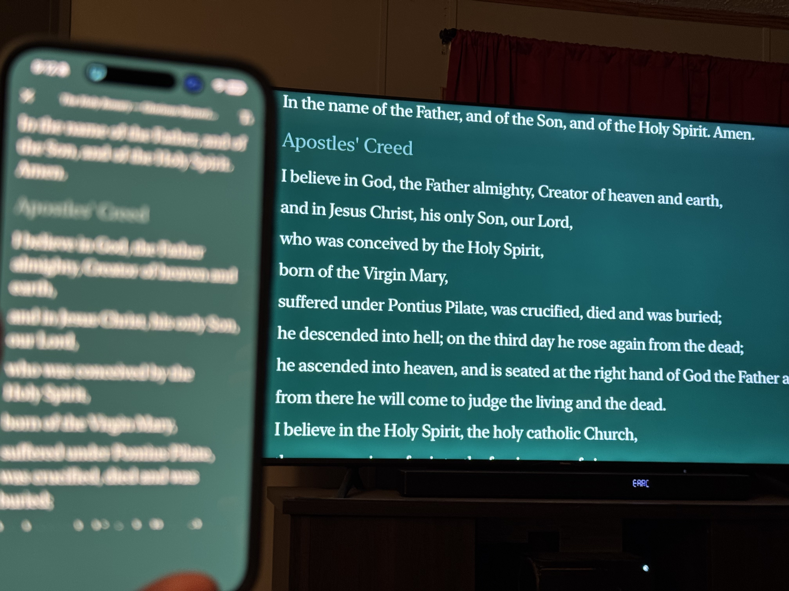
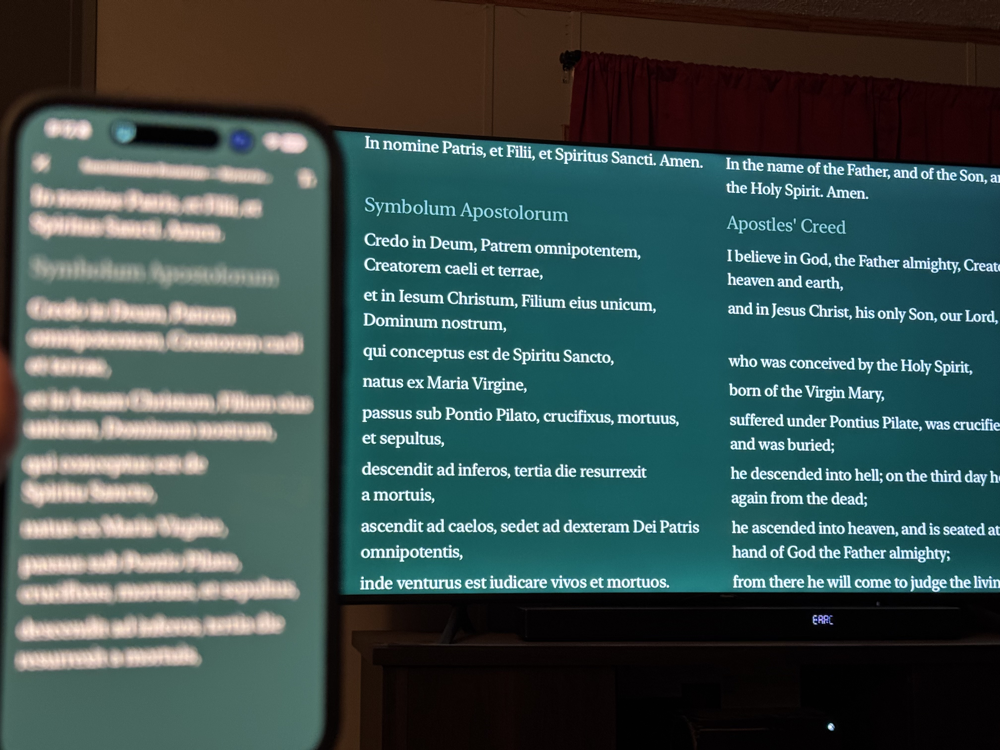

# Prayer AirPlay Demo

A SwiftUI iOS reference implementation showing an **innovative** way to
AirPlay text-heavy content from an iPhone to an Apple TV. Built as a
public reference for anyone whose app currently mirrors a portrait
transcript onto a landscape TV and ends up with a tall portrait box
wedged between two big black bars.

📺 **Watch the demo:** <https://youtu.be/HXl0p1c1N5M>



The phone keeps its portrait reader UI; the TV gets its own landscape
scene laid out for ten-foot viewing. Scrolling on the phone moves the
TV in lockstep — same line at the top, same fraction into that line,
both surfaces sharing one source of truth.



When the user picks **Latin** on the phone's first screen, the TV
switches to a side-by-side bilingual layout — Latin on the left,
English translation on the right, line-for-line — while the phone
continues to show just the Latin. Sync still tracks the Latin reading
exactly.

## A note for the Hallow team

My wife and I are devoted Hallow users — we pray together every day,
and we love casting our sessions to the TV via AirPlay so the prayers
fill the room. The transcript view is the one part that doesn't quite
land for us at home: when we mirror, the portrait phone view ends up
as a tall narrow box on a landscape TV, with the text too small to
read comfortably from across the couch.

This repo is what we hope an evening's worth of work could look like
for that specific case — a dedicated landscape "TV view" that fills
the screen with type sized for ten-foot viewing, while the phone
keeps its normal portrait UI for whoever is holding it. It's
deliberately small (one prayer, public-domain text, no audio, no
library) so the technique is the only thing it's showing. Take what's
useful, ignore what isn't.

If anyone on the Hallow team finds their way here and wants to talk
about it, we're rooting for you. Thank you for everything you're
building — the app has been a real gift to our marriage, and we mean
that.

— Justin

## The problem

When an iOS app shows text on the phone (lyrics, transcripts, prayer text,
captions) and the user AirPlays to an Apple TV, the default behaviour is
**Screen Mirroring**: the TV receives a literal pixel copy of the phone's
display. If the phone is portrait-locked, the TV is given a 9:16 portrait
canvas centred on a 16:9 landscape screen — leaving roughly 60% of the TV as
empty black bars on either side, with text typography tuned for an iPhone
held at arm's length, not for someone sitting ten feet from a TV.

The text ends up tiny, off-centre, and cropped. Hardly anyone in the room
can read it.

## The fix

iOS supports a second AirPlay mode where the app declares its own scene for
the external display. When the app provides a scene configuration for the
`UIWindowSceneSessionRoleExternalDisplayNonInteractive` role, iOS gives the
app a separate `UIWindowScene` rendered at the TV's native resolution
(typically 1920×1080 landscape). The phone keeps its own scene — portrait,
with navigation and controls — and the TV gets an independent landscape
scene laid out for 10-foot viewing.

The two scenes share state through a single `ObservableObject`, so when the
user scrolls on the phone, the TV follows in real time. But each scene is
laid out for its own canvas. No mirroring, no letterboxing, no shrunken
text.

## How the phone-to-TV scroll sync works

The phone publishes two values into the shared `PrayerSession`: the
**index of the line currently at the top** of its viewport, and the
**fraction (0...1) of how far it has scrolled into that line**. Both are
computed from the phone's own line-frame measurements via a SwiftUI
`PreferenceKey`, on every gesture frame from iOS 18's
`onScrollGeometryChange`. The TV scene measures its own line frames the
same way and applies a matching `.offset(y:)` translation so the same
logical line lands at the top of its viewport at the same in-line
fraction. There is no `ScrollView` and no `scrollTo` on the TV side, just
a continuous y translation tracking the phone's finger.

That line-index + line-fraction pair (rather than a single normalised
scroll progress) is what makes the bilingual mode work: the line index
is language-independent, so picking English or Latin doesn't disturb
the sync.

This demo shows that pattern end-to-end on a small, readable codebase.

## Latin: bilingual side-by-side on the TV

The first screen the user sees on the phone is a small picker:

- **English** — the original behaviour. Phone and TV both show the
  English transcript.
- **Latin** — the phone shows the traditional Tridentine Latin texts;
  the TV switches to a two-column layout with **Latin on the left** and
  the **English translation on the right**, line-for-line.

The two languages are stored as paired `PrayerLine` values
(`{ english, latin, isHeader }`), so a given line index points at the
same logical line regardless of which language is being displayed.
Picking a language doesn't reshuffle the data; it just chooses which
column(s) to render. That's why all the existing sync machinery keeps
working: the phone publishes line index N, the TV places the row at
index N at the top — whether that row is one column of English, one
column of Latin, or two side-by-side columns of both.

One small subtlety: in the side-by-side mode the row's visual height is
`max(latinColumn, englishColumn)`, but the user is reading the **Latin**
column on the phone. So the TV measures the Latin column (not the full
row) for sync. The English column rides alongside as visual translation;
if it wraps taller than the Latin, the extra height extends beyond the
measured row but is irrelevant to the in-line progress fraction. Without
this, sync drifts whenever the two languages wrap to a different number
of visual lines.

You can return to the language picker any time by tapping **X** on the
phone.

## Demo content

The sample content is the **Glorious Mysteries of the Holy Rosary**, in
both **English** and traditional **Latin** (Tridentine) form: Sign of the
Cross, Apostles' Creed / Symbolum Apostolorum, Our Father / Pater Noster,
Hail Mary / Ave Maria, Glory Be / Gloria Patri, Fatima Prayer / Oratio
Fatimae, and Hail Holy Queen / Salve Regina — all of which predate 1923
and are in the public domain. Lines that repeat (Hail Mary × 10 per
decade, etc.) are shown once with a count headline rather than literally
repeated, which keeps the transcript readable.

There is no audio playback, and there's no play/pause UI yet — the user
scrolls the prayer manually on the phone and the TV follows along. A
"now playing" mini-player will land in a later iteration; the layout
already reserves space for it at the bottom of the phone screen.

## How to run

Requirements: macOS with Xcode 16+, iOS 17+ deployment target. The included
project file builds with iOS 18.4 SDK.

1. Open `Airplay Demo.xcodeproj` in Xcode.
2. Pick an iPhone simulator or a real iPhone as the run destination.
3. Run.

To exercise the external-display scene **on the simulator**:

1. With the simulator running, choose `I/O > External Displays > Add New
   Display > 1920×1080`.
2. A second simulator window appears — that's the external display. It
   should show the dedicated landscape `TVRootView`, **not** a mirror of
   the phone.

To exercise it **on real hardware**:

1. Run the app on a physical iPhone.
2. Open Control Center → Screen Mirroring → pick an Apple TV (or any
   AirPlay-capable receiver).
3. The TV should show the landscape prayer view; the phone should keep
   its portrait controls.

> **Why no in-app AirPlay button?** `AVRoutePickerView` only surfaces
> the routes that the current `AVAudioSession` advertises — for an app
> with no audio playback, that's audio output devices only (AirPods,
> Bluetooth speakers) and not Apple TVs. There is no public iOS API
> that programmatically initiates Screen Mirroring; that path is
> reserved for Control Center. So we leave the system Control Center
> as the entry point and don't pretend otherwise inside the app.

## Manual test checklist

- [ ] Launch on iPhone — phone shows the **language picker** (English /
      Latine).
- [ ] Open Control Center → Screen Mirroring → pick an Apple TV.
- [ ] Before picking a language, the TV shows a centred splash
      ("Choose a language on iPhone to begin").
- [ ] Pick **English** — phone shows the portrait prayer view, TV shows
      the dedicated landscape single-column transcript, **not** a
      mirrored phone screen.
- [ ] Rotate the phone — phone stays portrait, TV stays landscape.
- [ ] Scroll the transcript on the phone — the TV scrolls in lockstep,
      smoothly, with no per-line jumping.
- [ ] Tap the "Tt" button — body text rescales through the four sizes
      on both the phone and the TV (each surface uses its own tier of
      the same scale), and the line at the top stays the same line.
- [ ] Tap "X" on the phone — phone returns to the language picker; TV
      returns to the splash.
- [ ] Pick **Latin** — phone shows the Latin transcript; TV shows the
      bilingual side-by-side layout (Latin left, English right). Scroll
      and confirm the same Latin line lands at the top of both.
- [ ] Stop AirPlay — phone view is unaffected; no crash.

## Key files to read

To follow the dual-scene pattern, read in this order:

1. **`Airplay Demo/Info.plist`** — declares both scene roles in the
   `UIApplicationSceneManifest`. Without this, iOS will never offer your
   app an external display scene.
2. **`Airplay Demo/AppDelegate.swift`** — routes incoming scene sessions
   to the right delegate based on `connectingSceneSession.role`.
3. **`Airplay Demo/ExternalSceneDelegate.swift`** — owns the TV's window
   and roots it in `TVRootView`. This is the file that catches the
   external display when it appears.
4. **`Airplay Demo/Views/TVRootView.swift`** — the landscape, full-bleed
   layout designed for 10-foot viewing. The whole point.

After that, the rest of the codebase is small and reads top-down:
`PhoneSceneDelegate.swift`, `Views/PhoneRootView.swift`, and the shared
state in `Models/PrayerSession.swift`.

## Architecture summary

```
PrayerAirPlayDemoApp.swift         @main + UIApplicationDelegateAdaptor
        │
        ▼
AppDelegate.swift                  routes scene roles → scene delegates
        │
        ├──► PhoneSceneDelegate.swift  ──► PhoneRootView   (portrait, controls)
        │                                       │
        │                                       ▼
        │                              PrayerSession.shared  ◄── @Observable
        │                                       ▲                    (single source
        ▼                                       │                     of truth)
ExternalSceneDelegate.swift  ──► TVRootView   (landscape, full-bleed)
```

The phone scene and the TV scene each own their own `UIWindow`. They
never talk to each other directly — they read and write the same
`PrayerSession.shared` instance (an `@Observable` class), and SwiftUI
keeps both views in sync. Four pieces of mutable state cross scenes:

- `language` (`PrayerLanguage?`) — `nil` until the user picks on the
  first screen; thereafter `.english` or `.latin`. Both scenes read this
  to decide what to render.
- `topLineIndex` (`Int`) — the index of the line currently at the top of
  the phone's viewport. The TV scrolls so that same line is at the top
  of its viewport.
- `topLineProgress` (`Double`, `0...1`) — how far the user has scrolled
  *into* that top line. Combined with `topLineIndex`, this is enough to
  re-position the TV at exactly the same point in the prayer regardless
  of differing line heights between the two surfaces.
- `fontScale` — the phone's "Tt" button writes here; the TV reads it and
  uses its own (larger) tier of the same scale, so 1-to-1 line
  correspondence is preserved across text-size changes.

`@Observable` (rather than `ObservableObject`) is used deliberately for
per-property change tracking: with `ObservableObject`, writing
`topLineProgress` 60+ times per second would re-render the phone's
~380-line transcript and the TV's matching offset would stutter. With
`@Observable`, only views that actually read a given property re-render
when it changes.

## Constraints / non-goals

- iPhone-only target (iPad will run, but isn't tuned for it).
- No real audio playback. A timer fakes line-by-line "playback".
- No persistence, no accounts, no library — one prayer, hardcoded.
- No third-party dependencies. SwiftUI + UIKit + AVKit only.

## Bundle identifier

The repo ships with `com.justinmiller.Airplay-Demo` and a placeholder
development team. If you fork this for your own use, change both in
`Airplay Demo.xcodeproj`'s project settings.

## License

MIT — see `LICENSE`.
